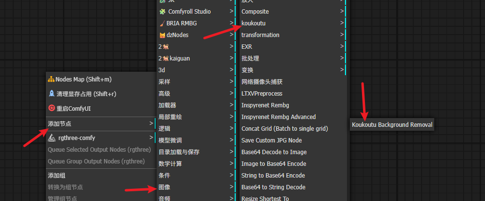
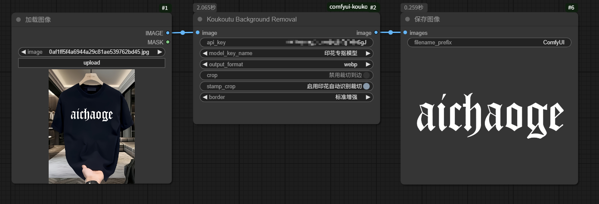
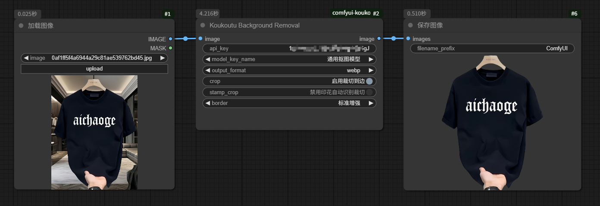

# Koukoutu ComfyUI Nodes

这是一个为 ComfyUI 提供 Koukoutu API 集成的节点包，目前支持背景移除功能。

## 功能特性

- **背景移除**: 使用`Koukoutu API`智能移除图像背景。
- **多种输出格式**: 支持`png`、`webp`格式输出。

## 安装

1. 将存储库克隆到您的`ComfyUI`自定义节点目录`custom_nodes`中:
   ```
   cd custom_nodes

   git clone https://github.com/zhenzi0322/comfyui-koukoutu.git
   ```

2. 将此文件夹复制到你的`ComfyUI`自定义节点目录`custom_nodes`:
   ```
   ComfyUI/custom_nodes/comfyui-koukoutu/
   ```

3. 安装依赖包:
   ```bash
   pip install -r requirements.txt
   ```

重启 ComfyUI

## 使用方法



### 剪切出印花图像

> 只需要启用节点中`启用印花自动识别裁切`。却可自动剪切出相应衣服上的印花图案并进行抠图。



### 不需要裁切出印花图案

> 禁用印花自动识别裁切。




## 工作流下载

[koukoutu_workflow工作流](https://github.com/zhenzi0322/comfyui-koukoutu/blob/master/workflows/koukoutu_workflow.json)

### 背景移除节点

1. 在 ComfyUI 中找到 `image/koukoutu` 分类
2. 添加 `Koukoutu Background Removal` 节点
3. 输入你的`Koukoutu API Key`。
4. 连接图像输入
5. 配置输出格式和裁剪选项
6. 运行工作流

### 获取 API Key

访问 [Koukoutu](https://www.koukoutu.com/user/dev) 注册账户并获取 API Key。

## 许可证

MIT License

## 支持

如有问题或建议，请访问 [Koukoutu](https://www.koukoutu.com/user/dev) 获取支持。
