# Koukoutu ComfyUI Nodes

一个为 [ComfyUI](https://github.com/comfyanonymous/ComfyUI) 提供 [Koukoutu API](https://www.koukoutu.com) 集成的节点包，涵盖抠图、印花提取、图生图、去水印、AI 阴影、高清放大等多种图像处理功能。

## 功能一览

| 节点 | 显示名称 | 说明 |
|---|---|---|
| 抠图 | 抠抠图-抠图功能 | 智能移除图像背景，支持 png/webp 输出 |
| 印花定位裁切 | 抠抠图-印花定位裁切功能 | 自动识别并裁切衣服上的印花图案 |
| 图生图 | 抠抠图-图生图功能 | 根据提示词生成新的图像 |
| 标准印花提取 | 抠抠图-标准印花提取功能 | 从图像中提取指定类型的印花/图案 |
| 中阶印花提取 | 抠抠图-中阶印花提取功能 | 效果更优的印花提取模型 |
| 去水印 | 抠抠图-去水印功能 | 自动移除图像中的水印 |
| AI 生成阴影 | 抠抠图-AI 生成阴影图功能 | 为透明图层图像生成 AI 阴影效果 |
| 通用放大 | 抠抠图-通用放大变清晰功能 | 高清放大图像，可选 2x/4x/6x |
| 扩图 | 抠抠图-扩图功能 | AI 扩展图像边缘，支持上/下/左/右独立设置 |

## 安装

1. 将存储库克隆到 ComfyUI 的 `custom_nodes` 目录：
   ```bash
   cd custom_nodes
   git clone https://github.com/zhenzi0322/comfyui-koukoutu.git
   ```

2. 安装依赖：
   ```bash
   pip install -r requirements.txt
   ```

3. 重启 ComfyUI，在 `image/koukoutu` 分类下即可看到所有节点。


也可以直接通过`comfy node install koukoutu`进行下载。

## 获取 API Key

访问 [Koukoutu 开发者中心](https://www.koukoutu.com/user/dev) 注册账户并获取 API Key。

---

## 节点详细说明

### 1. 抠图功能（Background Removal）

使用抠抠图同步 API 智能移除图像背景。

| 输入 | 类型 | 必填 | 说明 |
|---|---|---|---|
| image | IMAGE | 是 | 输入图像 |
| api_key | STRING | 是 | API Key |
| output_format | List | 否 | 输出格式：`png`（默认）/ `webp` |
| auto_crop | BOOLEAN | 否 | 是否自动识别裁切印花区域 |

**输出：** `IMAGE`

> 启用"印花自动识别裁切"可自动剪切出衣服上的印花图案并进行抠图。
> 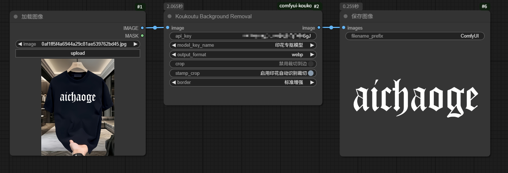
>
> 禁用裁切则直接输出抠图结果。
> 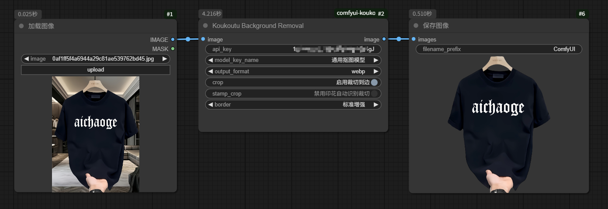

---

### 2. 印花定位裁切功能（Stamp Crop）

使用异步 API 自动定位并裁切图像中的印花/图案区域。

| 输入 | 类型 | 必填 | 说明 |
|---|---|---|---|
| image | IMAGE | 是 | 输入图像 |
| api_key | STRING | 是 | API Key |
| skip_error | BOOLEAN | 否 | 跳过错误（默认开） |

**输出：** `IMAGE` + `STRING`（成功/错误信息）

> 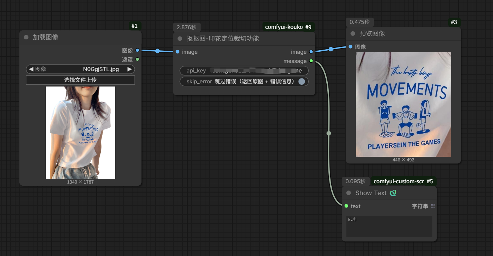
>
> [工作流](./workflows/stamp_crop.json)

---

### 3. 图生图功能（Image To Image）

根据提示词，基于输入图像生成新的图像。

| 输入 | 类型 | 必填 | 说明 |
|---|---|---|---|
| image | IMAGE | 是 | 输入图像 |
| api_key | STRING | 是 | API Key |
| prompt | STRING | 是 | 生成提示词 |
| negative_prompt | STRING | 否 | 反向提示词 |
| similarity | FLOAT | 否 | 相似度 0~1，默认 `0.80` |
| type | List | 否 | 类型：`1` / `2` |
| skip_error | BOOLEAN | 否 | 跳过错误（默认开） |

**输出：** `IMAGE` + `STRING`（成功/错误信息）

> 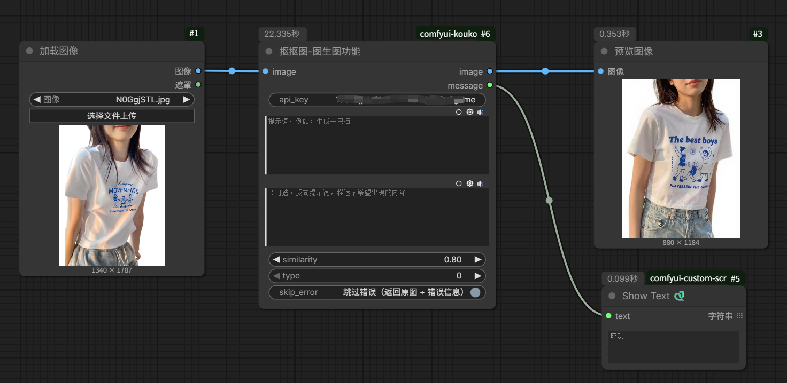
> 
> [工作流](./workflows/image-to-image.json)

---

### 4. 标准印花提取功能（Image Extract）

从图像中提取指定类型的印花或图案。

| 输入 | 类型 | 必填 | 说明 |
|---|---|---|---|
| image | IMAGE | 是 | 输入图像 |
| api_key | STRING | 是 | API Key |
| extract_type | STRING | 是 | 提取类型，如 `服装`、`鞋包`、`配饰` |
| resolution | List | 否 | 分辨率：`1k` / `4k` |
| size | List | 否 | 输出比例，19 种可选，默认 `0:0`（原图尺寸） |
| skip_error | BOOLEAN | 否 | 跳过错误（默认开） |

**输出：** `IMAGE` + `STRING`（成功/错误信息）

> 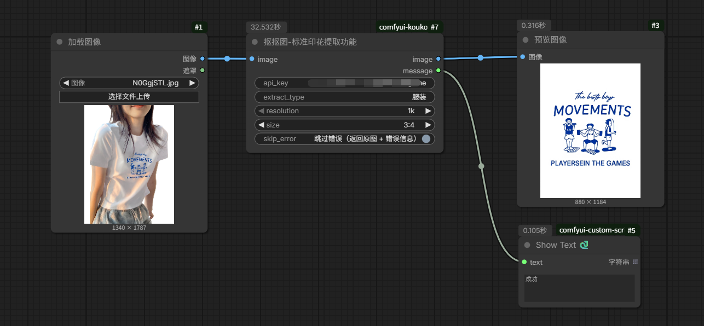
>
> [工作流](./workflows/image-extract.json)

---

### 5. 中阶印花提取功能（Image Extract V2）

效果更优的印花提取模型，参数与标准版相同。

| 输入 | 类型 | 必填 | 说明 |
|---|---|---|---|
| image | IMAGE | 是 | 输入图像 |
| api_key | STRING | 是 | API Key |
| extract_type | STRING | 是 | 提取类型，如 `服装`、`鞋包`、`配饰` |
| resolution | List | 否 | 分辨率：`1k` / `4k` |
| size | List | 否 | 输出比例，19 种可选，默认 `0:0`（原图尺寸） |
| skip_error | BOOLEAN | 否 | 跳过错误（默认开） |

**输出：** `IMAGE` + `STRING`（成功/错误信息）

> 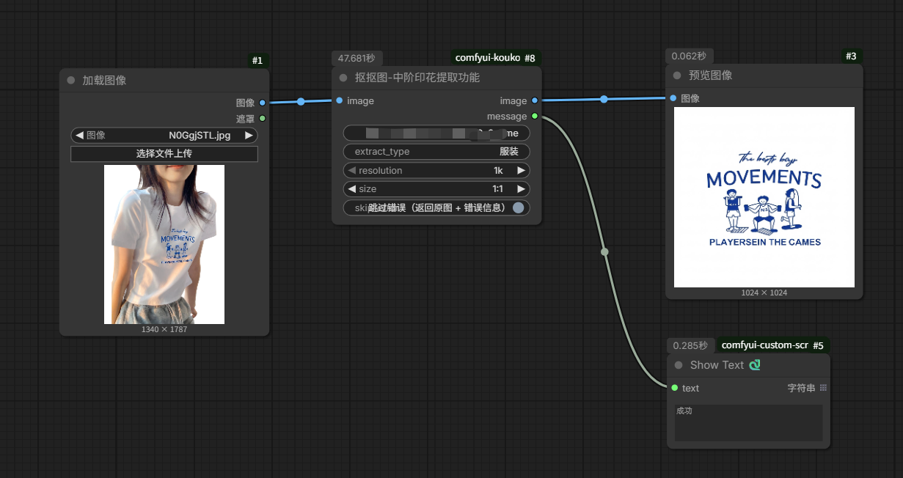
>
> [工作流](./workflows/image-extract-v2.json)

---

### 6. 去水印功能（Watermark Removal）

自动移除图像中的水印。

| 输入 | 类型 | 必填 | 说明 |
|---|---|---|---|
| image | IMAGE | 是 | 输入图像 |
| api_key | STRING | 是 | API Key |
| skip_error | BOOLEAN | 否 | 跳过错误（默认开） |

**输出：** `IMAGE` + `STRING`（成功/错误信息）

> 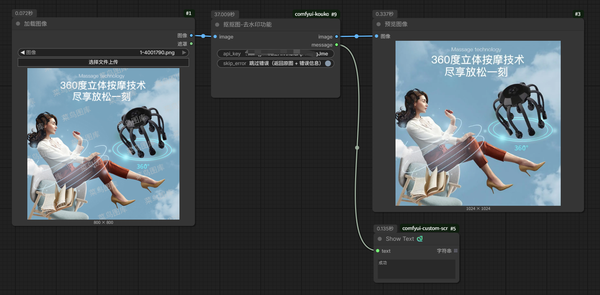
>
> [工作流](./workflows/image-watermark.json)

---

### 7. AI 生成阴影图功能（AI Shadow）

为带透明图层的 PNG 图像（抠图后）生成 AI 阴影效果。

| 输入 | 类型 | 必填 | 说明 |
|---|---|---|---|
| image | IMAGE | 是 | **必须为透明 PNG**（抠图后的图片） |
| api_key | STRING | 是 | API Key |
| shadow_opacity | FLOAT | 否 | 阴影浓度 0~1，默认 `0.75` |
| main_ratio | FLOAT | 否 | 主体占比 0~100，默认 `80` |
| background_color | STRING | 否 | 背景颜色，如 `#ffffff`，留空输出透明图 |
| skip_error | BOOLEAN | 否 | 跳过错误（默认开） |

**输出：** `IMAGE` + `STRING`（成功/错误信息）

> 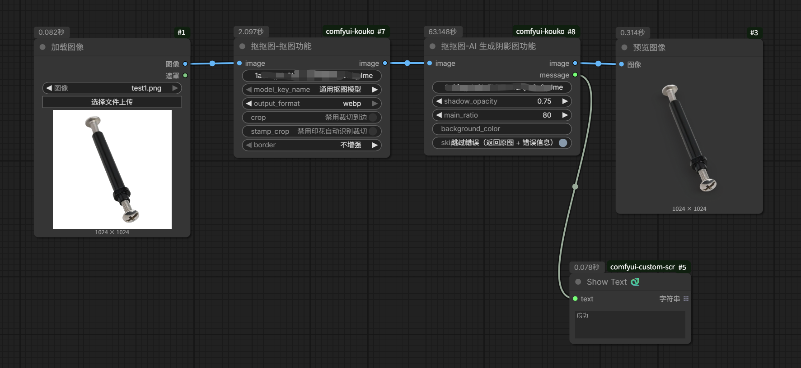
>
> [工作流](./workflows/image-shadow-v3.json)

---

### 8. 通用放大变清晰功能（Upscale）

对图像进行高清放大，提升清晰度。

| 输入 | 类型 | 必填 | 说明 |
|---|---|---|---|
| image | IMAGE | 是 | 输入图像 |
| api_key | STRING | 是 | API Key |
| scale | List | 否 | 放大倍数：`2` / `4`（默认） / `6` |
| skip_error | BOOLEAN | 否 | 跳过错误（默认开） |

**输出：** `IMAGE` + `STRING`（成功/错误信息）

> 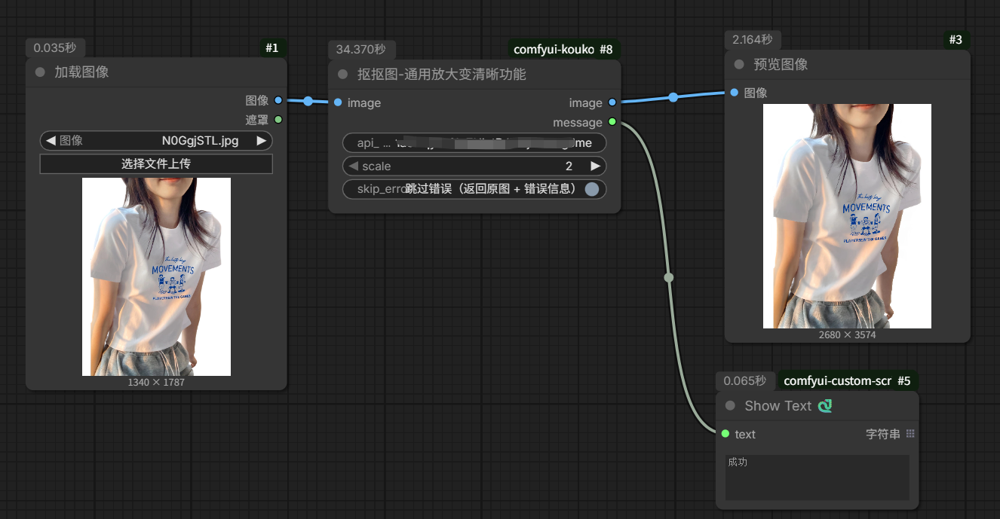
>
> [下载工作流](workflows/upscale2stamp.json)


### 9. 扩图功能（Outpaint）

使用 AI 智能扩展图像边缘，支持分别设置上、下、左、右四个方向的扩图边距。

| 输入 | 类型 | 必填 | 说明 |
|---|---|---|---|
| image | IMAGE | 是 | 输入图像 |
| api_key | STRING | 是 | API Key |
| left | INT | 否 | 左侧扩图边距（像素），默认 `0` |
| right | INT | 否 | 右侧扩图边距（像素），默认 `0` |
| top | INT | 否 | 上方扩图边距（像素），默认 `365` |
| bottom | INT | 否 | 下方扩图边距（像素），默认 `0` |
| skip_error | BOOLEAN | 否 | 跳过错误（默认开） |

**输出：** `IMAGE` + `STRING`（成功/错误信息）


---

## 工作流

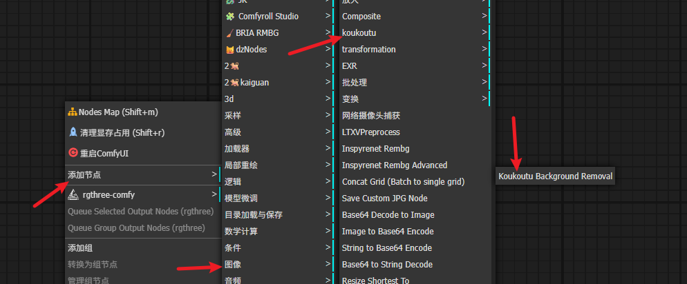

[下载示例工作流](https://github.com/zhenzi0322/comfyui-koukoutu/blob/master/workflows/koukoutu_workflow.json)

## 错误处理

所有异步节点均支持 `skip_error` 参数：

- **开启（默认）**：遇到 API 错误时返回原图 + 错误信息文本，不中断工作流。
- **关闭**：遇到错误时抛出异常，中断工作流。

可通过连接 `STRING` 输出到文本节点或显示节点来查看错误详情。

## 相关功能查找

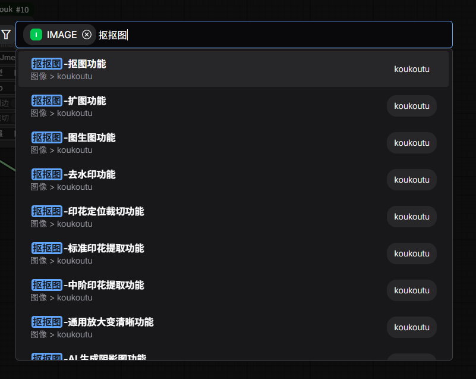

## 许可证

MIT License

## 支持

如有问题或建议，请访问 [Koukoutu 开发者中心](https://www.koukoutu.com/user/dev) 获取支持。
